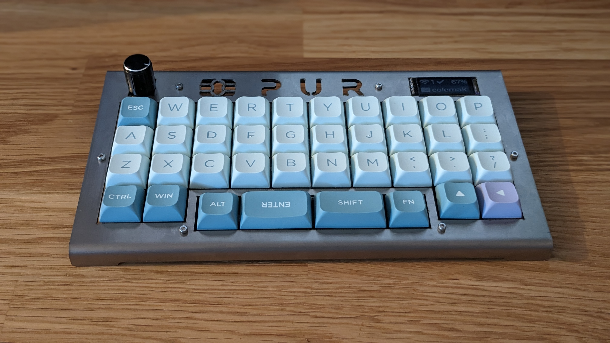
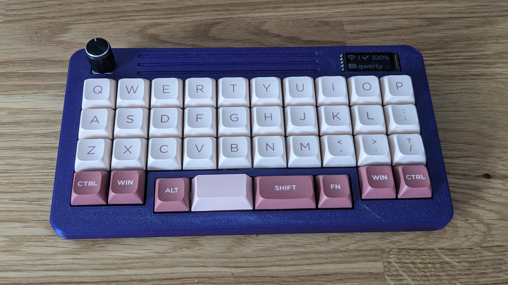

# PUR

A 38-key low profile orthogonal keyboard with an offset space bar row. 

## Highlights

- designed around Gateron KS27/KS33 low profile switches.
- rotary encoder support.
- bluetooth and USB connection.
- nice!view display.
- ZMK keyboard firmware support.
- open source.

## How to build one
