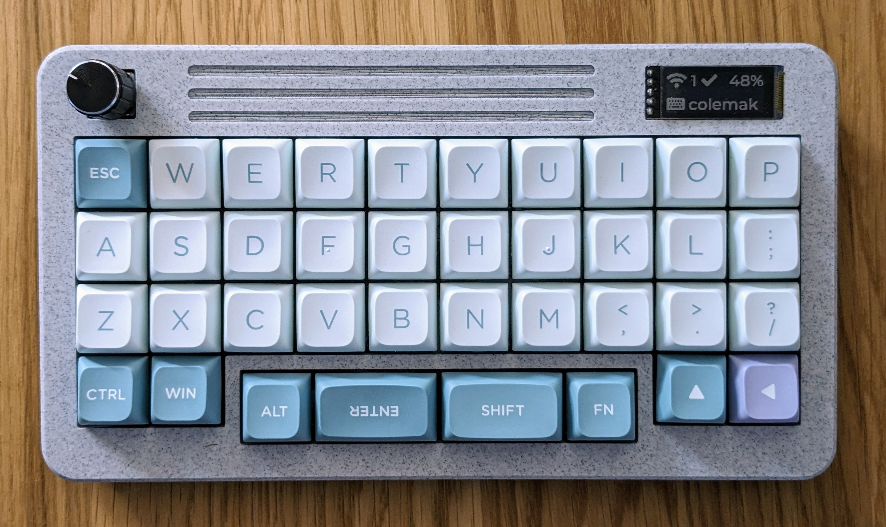
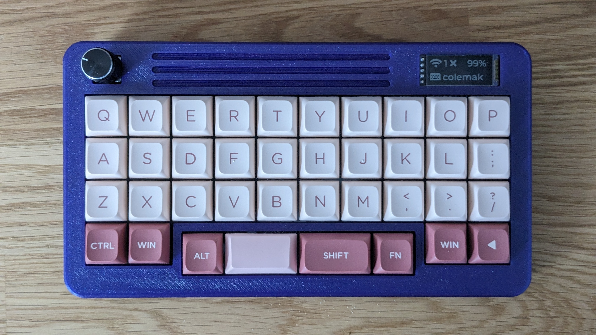
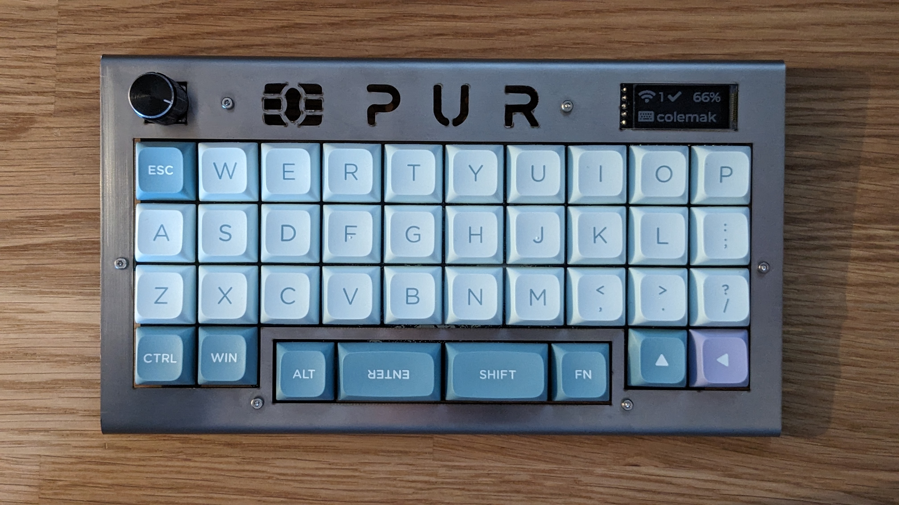
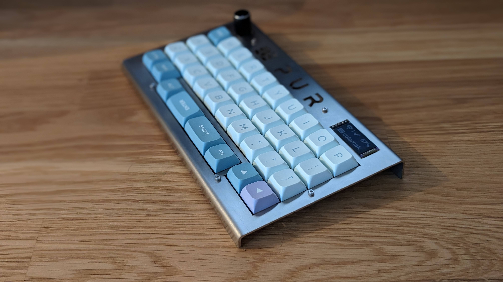
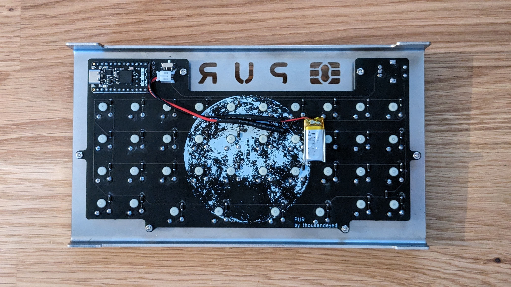

# PUR

A 38-key low profile orthogonal keyboard with an offset space bar row. 

## About

This keyboard reinterprets the beautiful design of an offset space row offered by weteor https://github.com/weteor/SPC_EVDR. I wanted to build something similar in appearance, but in lower height. Here are the main highlights of PUR:
- designed around Gateron KS27/KS33 low profile switches.
- rotary encoder support.
- bluetooth and USB connection.
- nice!view display.
- nice!nano MCU
- ZMK keyboard firmware support.
- open source.

## How to build one

I provide all the production files you will need in order to assemble the keyboard. In [prod](prod/) folder you will find the PCB gerbers, STLs for 3D printed case and a drawing for metal sheet case (or, should one say, a frame). In the [build instructions](prod/build.md) you will find a detailed list parts needed as well as a suggested assembly order.

## Firmware

PUR utilizes ZMK keyboard firmware. You can find my personal ZMK config [here](https://github.com/1000eyed/zmk-config-pur). Go to worklows and download the firmare from the latest successful run. Instructions on how to flash your nice!nano are [here](https://nicekeyboards.com/docs/nice-nano/getting-started/).

## Open source

In [source](source/) directory you will find the source files for the PCB and the cases. You may use them however you like, I kindly ask you though to link back to my project, should you build or update something. Which I strongly encourage, as there are a handful of design pitfalls.

## Gallery

